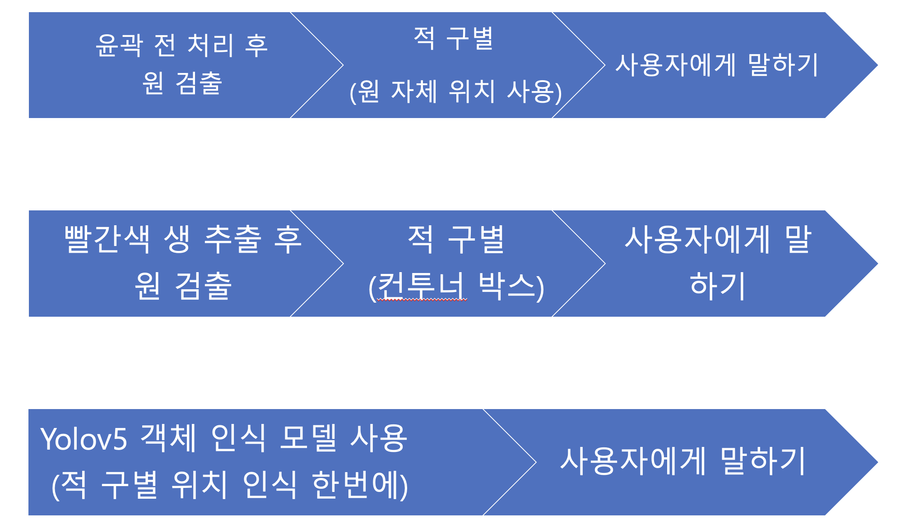
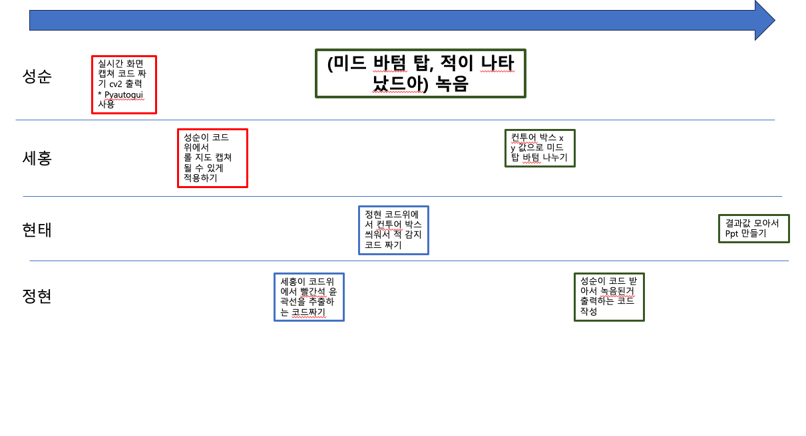
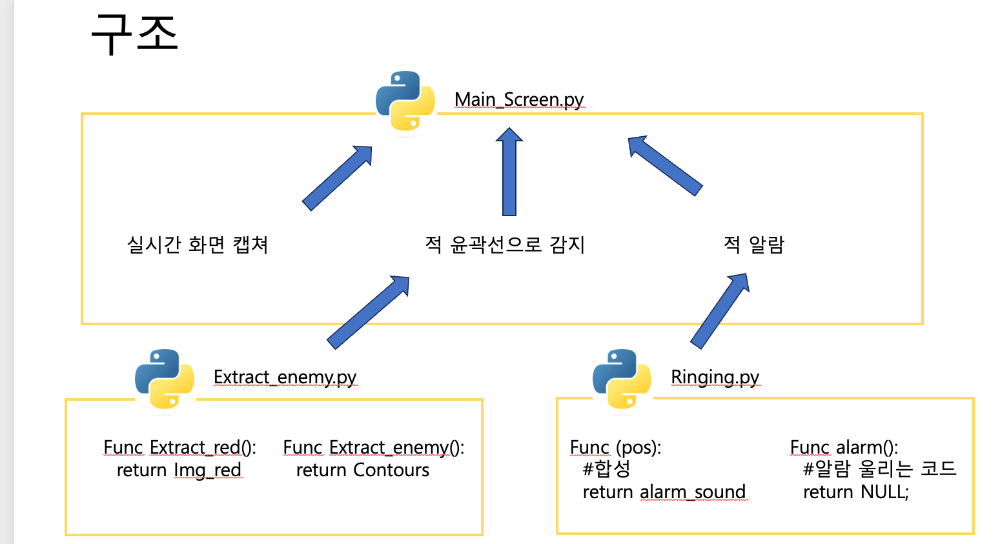

 

#### 
introduction

#### It is not easy to recognize the enemies that appear on the LoL map. [🎮 Games](#https://www.leagueoflegends.com/ko-kr/)
It is a project let us recognize the enemy through auditory information, not visual information.

### 
OUTLINE

| way     | pros and cons                               |
|---------|---------------------------------------------|
 | way1 장점 | 적 상태가 원이라는 점을 이용 만약 원이 다 드러나면 원 추출 능력이 뛰어남  |
| way1 단점 | 적과 아군 구분이 힘들 수 있음, 원이 겹쳤을때 감지 할 지 의문        |
| way2 장점 | 적 상태가 원 테두리가 빨간색이라는 점을 이용 적 만 탐지할 수 있는 특징이있음 |
| way2 단점 | 원 말고 빨간색 노이즈가 있음. 이거랑 적이랑 구별하는 알고리즘이 필요     |
| way3 | 안할것 같음 |

### 
1.1.1 [🎶](#-sound) way2 채택

### 프로그래밍 일정

### 프로그래밍 구조

